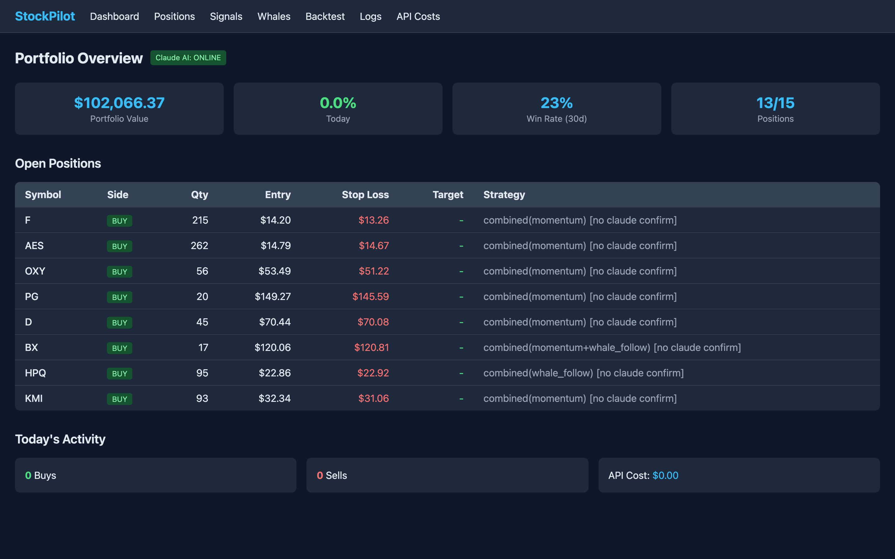
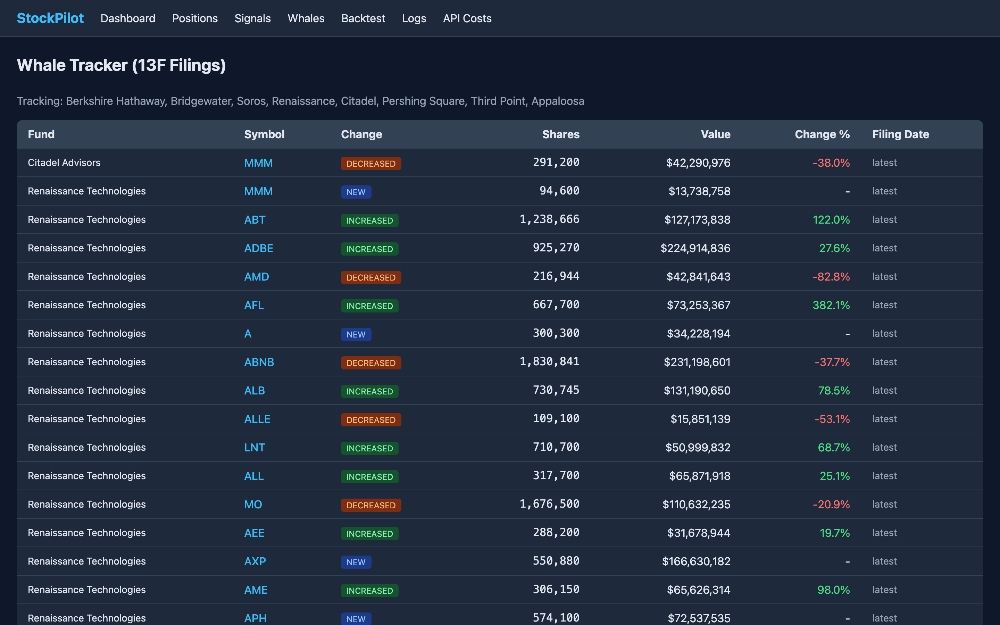
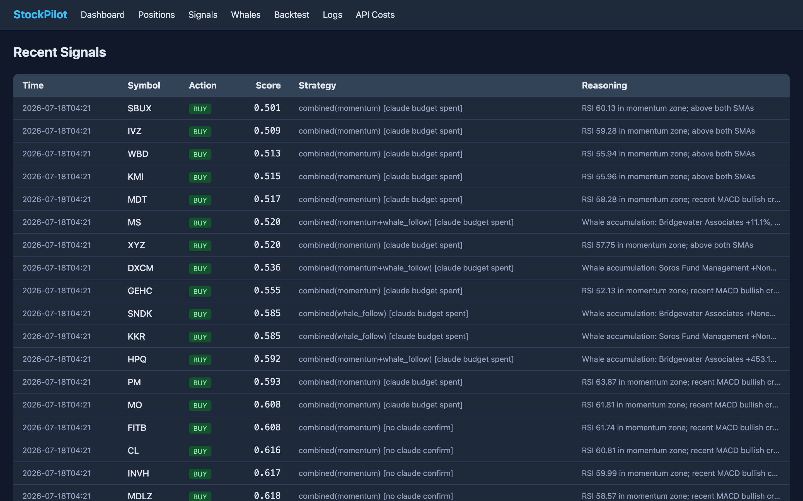
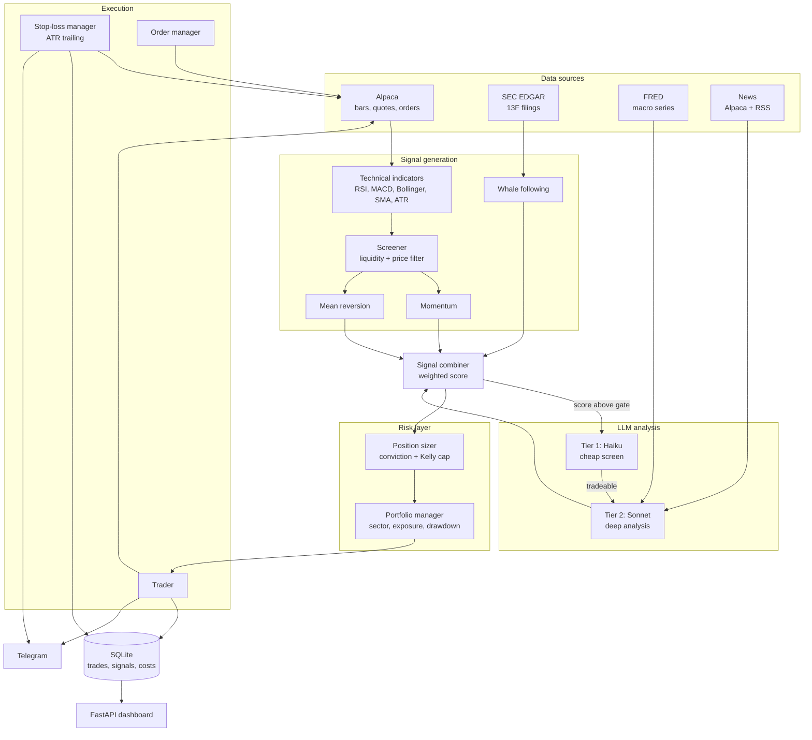

<div align="center">


<br>

### Equity research, explainable signals and risk controls — tested through paper trading.

<br>

<a href="#installation"></a> <a href="LICENSE"></a> <a href="#safety"></a> <a href="https://github.com/AdrianAdem/stockpilot"></a>

<br><br>

<a href="#screenshots">Screenshots</a> &nbsp; · &nbsp; <a href="#installation">Get started</a> &nbsp; · &nbsp; <a href="#license">License</a>

<br><br>

</div>

> **Status: paper-trading validation.** The system is built for live execution, but is currently running against an Alpaca paper account while the strategy is being forward-tested. The client is deliberately hard-locked to the paper endpoint (see [Safety](#safety)); enabling live trading is an explicit, manual change.
>
> **Not investment advice.** Nothing here is a recommendation to buy or sell any security. Backtested and paper results do not predict future performance. If you run this with real money, that is your decision and your risk.

<br>

## Problem

Most hobby trading bots are a single indicator wired to a market order. That fails in two places: signal quality (one indicator is noise) and risk (nothing stops a position from growing until it dominates the portfolio).

StockPilot separates those concerns. Four independent signal sources are merged into one weighted score, and every order then has to clear a risk layer that owns position sizing, sector exposure, drawdown limits and exits. A signal can be strong and still be rejected — that is intended behaviour, not a bug.

<br>

## Features

- **Four signal sources, weighted** — momentum, mean reversion, 13F whale-following and an LLM analyst, merged into a single score with a configurable entry threshold.
- **Two-tier LLM analysis** — Claude Haiku screens candidates cheaply; only survivors reach Claude Sonnet for full analysis (technicals + news + institutional flow + macro). A per-scan call budget caps token spend; the static system prompt is cached.
- **13F institutional tracking** — parses SEC EDGAR filings for 8 funds (Berkshire Hathaway, Bridgewater, Soros, Renaissance Technologies, Citadel, Pershing Square, Third Point, Appaloosa), diffs consecutive quarters and resolves issuer names to tradeable tickers to build a buy-consensus signal.
- **Risk-based position sizing** — each trade is sized so that being stopped out costs the same fraction of equity (default 0.25%), so a wide-stop name gets a small position rather than the same weight as a tight-stop one. Bounded by a hard 5% per-position cap.
- **Hard risk layer** — per-position cap, max concurrent positions, GICS sector limits, minimum cash reserve, daily and weekly drawdown circuit breakers, and no averaging into an existing position.
- **ATR trailing exits** — initial stop at `entry − 2×ATR`, then a continuous trailing stop at `price − 2.5×ATR` that only ratchets upward. Stops are submitted as broker-side GTC orders. Protection depends on those orders remaining accepted and open; graceful shutdown cancels open orders. Updates prefer an atomic order replace and fall back to cancel-and-recreate if the broker rejects it; a reconciliation pass — running inside and outside market hours — aims to reconcile each open position to one full-size stop; broker errors and the interval between passes can leave gaps.
- **Backtesting** — no-lookahead engine (signal on day *i* fills at day *i+1* open; stops checked against intraday lows), plus standalone harnesses that isolate exit models and position-sizing models for controlled A/B comparison. See [Method](#method).
- **Operations** — FastAPI dashboard, Telegram notifications and remote control, structured JSON logging, per-call API cost tracking.

<br>

## Screenshots

**Portfolio overview** — open positions with their live ATR trailing stops and the strategies that produced each entry. The `[no claude confirm]` tag marks entries the LLM layer declined to endorse, so the provenance of every position stays visible.



<details>
<summary>More product screens and details</summary>

**Whale tracker** — 13F filings parsed from SEC EDGAR, diffed against the previous quarter and resolved to tradeable tickers.



**Signal log** — every combined signal with score, contributing strategies and reasoning, including the ones that never cleared the entry gate.



</details>

<br>

## Tech stack


Fully async (`asyncio` + `httpx`). Technical indicators (RSI, MACD, Bollinger Bands, SMA 50/200, ATR, volume ratio) are implemented directly on pandas/numpy — no TA library dependency. Pydantic models for configuration and domain objects.

<br>

## Architecture



The main loop runs every 15 minutes while the market is open: reconcile broker-side exits → update trailing stops → evaluate time stops → risk check → screen universe → generate signals → size and execute.

<br>

## Installation

Requires Python 3.11+.

```bash
git clone https://github.com/AdrianAdem/stockpilot.git
cd stockpilot
python3 -m venv .venv && source .venv/bin/activate
pip install -r requirements.txt
cp .env.example .env    # then fill in your keys
```

### Environment variables

All configuration lives in `.env`; no credentials are read from anywhere else.

| Variable | Description |
|---|---|
| `ALPACA_API_KEY` / `ALPACA_SECRET_KEY` | Alpaca **paper** trading credentials |
| `ALPACA_BASE_URL` | Must be `https://paper-api.alpaca.markets` — the client rejects anything else |
| `ANTHROPIC_API_KEY` | Claude API key |
| `FRED_API_KEY` | FRED macro data (free) |
| `TELEGRAM_BOT_TOKEN` / `TELEGRAM_CHAT_ID` | Notifications and remote control |
| `SEC_USER_AGENT` | Contact string required by SEC EDGAR, e.g. `stockpilot you@example.com` |

Tuning knobs (defaults shipped in `.env.example`):

| Variable | Default | Meaning |
|---|---|---|
| `MIN_SIGNAL_SCORE` | `0.65` | Combined score required to open a position |
| `MAX_POSITION_PCT` / `MAX_POSITIONS` | `0.03` / `15` | Base position weight, max concurrent positions |
| `MAX_SECTOR_PCT` / `MAX_PORTFOLIO_INVESTED` | `0.40` / `0.80` | Sector cap, minimum cash reserve |
| `DAILY_DRAWDOWN_LIMIT` / `WEEKLY_DRAWDOWN_LIMIT` | `0.02` / `0.05` | Circuit breakers |
| `ATR_INITIAL_STOP_FACTOR` / `ATR_TRAILING_FACTOR` | `2.0` / `2.5` | Stop distance in ATR multiples |
| `SCREENER_MIN_VOLUME` / `SCREENER_MIN_PRICE` | `200000` / `5` | Liquidity filter (volume measured on the IEX feed) |
| `MAX_CLAUDE_CALLS_PER_SCAN` | `12` | Token-cost ceiling per scan |
| `MOMENTUM_WEIGHT` / `MEAN_REVERSION_WEIGHT` / `WHALE_FOLLOW_WEIGHT` / `CLAUDE_WEIGHT` | `0.30` / `0.25` / `0.25` / `0.20` | Signal blend |

<br>

## Usage

```bash
# Run the bot (trades only while the US market is open)
python -m main
```

Dashboard at `http://localhost:8000` — routes: `/` (portfolio), `/positions`, `/signals`, `/whales`, `/costs`, `/backtest`, `/logs`, plus `/api/equity-curve` and `/api/summary` as JSON.

Docker:

```bash
docker compose up -d
docker compose logs -f
```

Backtesting:

```bash
# Exit models: fixed 2-stage vs continuous ATR trailing at several factors
python -m backtest.exit_compare

# Position sizing: flat percentage vs risk-based, cooldown, portfolio stop
python -m backtest.risk_sizing_compare

# Position sizing: flat vs volatility-scaled (earlier experiment)
python -m backtest.sizing_compare
```

Telegram control: `/status`, `/positions`, `/history`, `/pause`, `/resume`, `/kill`.

<br>

## Method

Parameters are chosen by controlled backtest, not intuition. Each experiment
freezes everything except the variable under test, and the trade count is
reported so an unchanged entry set is verifiable. Two examples:

**Exit model** — the original two-stage trailing stop returned more on paper
but carried an −83.7% drawdown. Continuous ATR trailing at N=2.5 more than
doubled the Sharpe ratio (0.65 → 1.38) and cut the drawdown to −15.5%.

**Position sizing** — flat percentage sizing gave a high-volatility name the
same portfolio weight as a quiet one, so it risked 3–4× more per trade. Sizing
by stop distance left the Sharpe ratio unchanged but halved the worst single
trade (−$506 → −$267). It shipped for the risk reduction, not for return.

Rejected changes are documented too, including a portfolio-level stop that
looked appealing and tested at −0.49 Sharpe.

Full results, including the reasoning and the rejected variants:
**[docs/BACKTESTS.md](docs/BACKTESTS.md)**

Backtests only decide whether a change ships. Whether the strategy actually
works is a separate question, answered by forward testing on unseen data —
tracked in [FORWARD-TEST.md](FORWARD-TEST.md) against pass/fail criteria that
were fixed before data collection began. The most recent completed run failed
3 of 6 criteria; that is recorded there rather than quietly dropped.

<br>

## Safety

- **Paper lock (current phase):** `AlpacaClient` raises on construction if `ALPACA_BASE_URL` is not the paper endpoint, and `verify_paper_account()` runs at startup. Removing this guard is a conscious one-line decision, which is exactly the point — live trading should never be reachable by a stray config value.
- Drawdown breakers halt new entries for the day (−2%) and pause the bot entirely for the week (−5%).
- The system submits broker-side GTC stops and reconciles coverage each cycle. This is not a continuous coverage guarantee: partial fills, manual changes and broker errors require reconciliation.
- Graceful shutdown cancels all open orders on `SIGINT`/`SIGTERM`.
- `.env`, logs and the SQLite database are gitignored; no credentials are committed.

<br>

## Project layout

```
config/      settings, S&P 500 universe + GICS sectors, strategy parameters
data/        Alpaca client, SEC 13F parser, indicators, news, FRED
strategy/    momentum, mean reversion, whale following (Strategy ABC)
analysis/    Claude analyst (2-tier), signal combiner, screener, whale tracker
risk/        position sizer, portfolio manager, ATR stop-loss manager
execution/   trader, order manager, Telegram notifier + command handler
storage/     aiosqlite database, Pydantic models
backtest/    no-lookahead engine, exit and sizing comparison harnesses
dashboard/   FastAPI app + Jinja2 templates
```

<br>

## Disclaimer

The system is designed for live execution but is currently in a **paper-trading validation phase**. Going live is a deliberate configuration change, not a default — the Alpaca client refuses any non-paper endpoint as shipped.

This is **not investment advice** and not a recommendation to buy or sell any security. Backtest results are historical simulations built on explicit modelling assumptions (slippage, next-open fills, intraday stop checks) and neither they nor paper results predict future performance. Trading equities involves risk of loss. If you deploy this against a funded account, you do so entirely at your own risk and responsibility.

<br>

## License

MIT — see [LICENSE](LICENSE).
