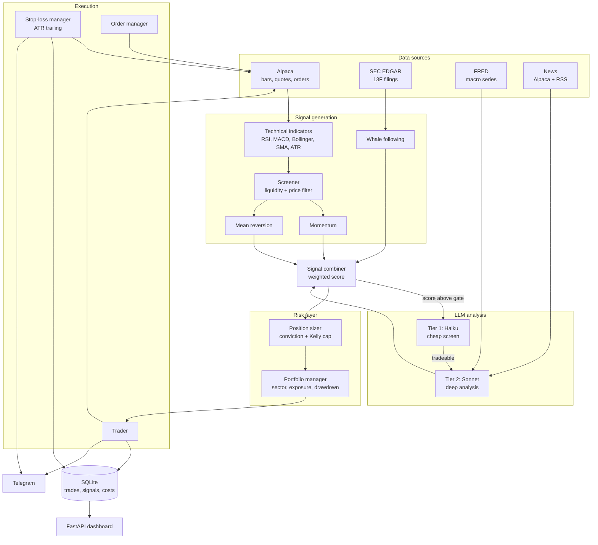

# StockPilot

Autonomous equity trading bot for Alpaca paper trading — combines technical strategies, 13F institutional filings and a two-tier LLM analysis layer behind a hard risk-management gate.

> **Status: paper-trading validation.** The system is built for live execution, but is currently running against an Alpaca paper account while the strategy is being forward-tested. The client is deliberately hard-locked to the paper endpoint (see [Safety](#safety)); enabling live trading is an explicit, manual change.
>
> **Not investment advice.** Nothing here is a recommendation to buy or sell any security. Backtested and paper results do not predict future performance. If you run this with real money, that is your decision and your risk.

## Problem

Most hobby trading bots are a single indicator wired to a market order. That fails in two places: signal quality (one indicator is noise) and risk (nothing stops a position from growing until it dominates the portfolio).

StockPilot separates those concerns. Four independent signal sources are merged into one weighted score, and every order then has to clear a risk layer that owns position sizing, sector exposure, drawdown limits and exits. A signal can be strong and still be rejected — that is intended behaviour, not a bug.

## Features

- **Four signal sources, weighted** — momentum, mean reversion, 13F whale-following and an LLM analyst, merged into a single score with a configurable entry threshold.
- **Two-tier LLM analysis** — Claude Haiku screens candidates cheaply; only survivors reach Claude Sonnet for full analysis (technicals + news + institutional flow + macro). A per-scan call budget caps token spend; the static system prompt is cached.
- **13F institutional tracking** — parses SEC EDGAR filings for 8 funds (Berkshire Hathaway, Bridgewater, Soros, Renaissance Technologies, Citadel, Pershing Square, Third Point, Appaloosa), diffs consecutive quarters and resolves issuer names to tradeable tickers to build a buy-consensus signal.
- **Hard risk layer** — per-position cap, max concurrent positions, GICS sector limits, minimum cash reserve, daily and weekly drawdown circuit breakers, and no averaging into an existing position.
- **ATR trailing exits** — initial stop at `entry − 2×ATR`, then a continuous trailing stop at `price − 2.5×ATR` that only ratchets upward. Stops are real GTC orders at the broker, updated by atomic order replacement (no unprotected window). A reconciliation pass guarantees every open position is covered by exactly one full-size stop.
- **Backtesting** — no-lookahead engine (signal on day *i* fills at day *i+1* open; stops checked against intraday lows), plus standalone harnesses that isolate exit models and position-sizing models for controlled A/B comparison.
- **Operations** — FastAPI dashboard, Telegram notifications and remote control, structured JSON logging, per-call API cost tracking.

## Tech stack


Fully async (`asyncio` + `httpx`). Technical indicators (RSI, MACD, Bollinger Bands, SMA 50/200, ATR, volume ratio) are implemented directly on pandas/numpy — no TA library dependency. Pydantic models for configuration and domain objects.

## Architecture



The main loop runs every 15 minutes while the market is open: reconcile broker-side exits → update trailing stops → evaluate time stops → risk check → screen universe → generate signals → size and execute.

## Installation

Requires Python 3.11+.

```bash
git clone https://github.com/AdrianAdem/stockpilot.git
cd stockpilot
python3 -m venv .venv && source .venv/bin/activate
pip install -r requirements.txt
cp .env.example .env    # then fill in your keys
```

### Environment variables

All configuration lives in `.env`; no credentials are read from anywhere else.

| Variable | Description |
|---|---|
| `ALPACA_API_KEY` / `ALPACA_SECRET_KEY` | Alpaca **paper** trading credentials |
| `ALPACA_BASE_URL` | Must be `https://paper-api.alpaca.markets` — the client rejects anything else |
| `ANTHROPIC_API_KEY` | Claude API key |
| `FRED_API_KEY` | FRED macro data (free) |
| `TELEGRAM_BOT_TOKEN` / `TELEGRAM_CHAT_ID` | Notifications and remote control |
| `SEC_USER_AGENT` | Contact string required by SEC EDGAR, e.g. `stockpilot you@example.com` |

Tuning knobs (defaults shipped in `.env.example`):

| Variable | Default | Meaning |
|---|---|---|
| `MIN_SIGNAL_SCORE` | `0.65` | Combined score required to open a position |
| `MAX_POSITION_PCT` / `MAX_POSITIONS` | `0.03` / `15` | Base position weight, max concurrent positions |
| `MAX_SECTOR_PCT` / `MAX_PORTFOLIO_INVESTED` | `0.40` / `0.80` | Sector cap, minimum cash reserve |
| `DAILY_DRAWDOWN_LIMIT` / `WEEKLY_DRAWDOWN_LIMIT` | `0.02` / `0.05` | Circuit breakers |
| `ATR_INITIAL_STOP_FACTOR` / `ATR_TRAILING_FACTOR` | `2.0` / `2.5` | Stop distance in ATR multiples |
| `SCREENER_MIN_VOLUME` / `SCREENER_MIN_PRICE` | `200000` / `5` | Liquidity filter (volume measured on the IEX feed) |
| `MAX_CLAUDE_CALLS_PER_SCAN` | `12` | Token-cost ceiling per scan |
| `MOMENTUM_WEIGHT` / `MEAN_REVERSION_WEIGHT` / `WHALE_FOLLOW_WEIGHT` / `CLAUDE_WEIGHT` | `0.30` / `0.25` / `0.25` / `0.20` | Signal blend |

## Usage

```bash
# Run the bot (trades only while the US market is open)
python -m main
```

Dashboard at `http://localhost:8000` — routes: `/` (portfolio), `/positions`, `/signals`, `/whales`, `/costs`, `/backtest`, `/logs`, plus `/api/equity-curve` and `/api/summary` as JSON.

Docker:

```bash
docker compose up -d
docker compose logs -f
```

Backtesting:

```bash
# Compare exit models: fixed 2-stage vs ATR trailing at several factors
python -m backtest.exit_compare

# Compare position-sizing models: flat vs volatility-scaled
python -m backtest.sizing_compare
```

Telegram control: `/status`, `/positions`, `/history`, `/pause`, `/resume`, `/kill`.

## Screenshots

<!-- Replace the placeholders below with real screenshots -->
| Dashboard | Signals | Whale tracker |
|---|---|---|
| _screenshot placeholder_ | _screenshot placeholder_ | _screenshot placeholder_ |

## Safety

- **Paper lock (current phase):** `AlpacaClient` raises on construction if `ALPACA_BASE_URL` is not the paper endpoint, and `verify_paper_account()` runs at startup. Removing this guard is a conscious one-line decision, which is exactly the point — live trading should never be reachable by a stray config value.
- Drawdown breakers halt new entries for the day (−2%) and pause the bot entirely for the week (−5%).
- Every position carries a broker-side GTC stop; a reconciliation pass each cycle guarantees exactly one full-size stop per position, so a partial fill or a manual change cannot leave shares unprotected.
- Graceful shutdown cancels all open orders on `SIGINT`/`SIGTERM`.
- `.env`, logs and the SQLite database are gitignored; no credentials are committed.

## Project layout

```
config/      settings, S&P 500 universe + GICS sectors, strategy parameters
data/        Alpaca client, SEC 13F parser, indicators, news, FRED
strategy/    momentum, mean reversion, whale following (Strategy ABC)
analysis/    Claude analyst (2-tier), signal combiner, screener, whale tracker
risk/        position sizer, portfolio manager, ATR stop-loss manager
execution/   trader, order manager, Telegram notifier + command handler
storage/     aiosqlite database, Pydantic models
backtest/    no-lookahead engine, exit and sizing comparison harnesses
dashboard/   FastAPI app + Jinja2 templates
```

## Disclaimer

The system is designed for live execution but is currently in a **paper-trading validation phase**. Going live is a deliberate configuration change, not a default — the Alpaca client refuses any non-paper endpoint as shipped.

This is **not investment advice** and not a recommendation to buy or sell any security. Backtest results are historical simulations built on explicit modelling assumptions (slippage, next-open fills, intraday stop checks) and neither they nor paper results predict future performance. Trading equities involves risk of loss. If you deploy this against a funded account, you do so entirely at your own risk and responsibility.

## License

MIT — see [LICENSE](LICENSE).
